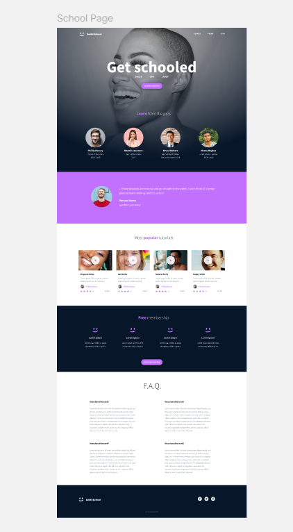

# ALX HTML & CSS Advanced Project

Project Overview

This project is part of the ALX HTML & CSS Advanced Course. The main objective is to replicate a design created in Figma using HTML5 and CSS3, focusing specifically on the styling, layout, typography, and responsiveness of the page.

Features

Header & Navigation: Logo image and navigation links for Course, Pricing, and Login.

Hero Section: High‑impact presentation with a primary title, highlight words, and a call‑to‑action button (“Register for Free”).

Instructor Section: A set of instructor profile cards featuring photos, names, and achievements.

Testimonials Section: A testimonial block including a quote, author name, and subtitle.

Popular Tutorials Section: A grid of tutorial cards each showing an image, title, description, author name and photo, star rating (5 stars), and duration.

Free Membership Section: Highlights of membership benefits with icons, titles, and descriptive text, together with a registration button.

FAQ Section: A section with frequently asked questions and answers arranged in a structured layout.

Footer: Footer layout with logo image, social media icons (Facebook, Twitter, Instagram), and copyright.

Fonts & Icons

Fonts used: Source Sans Pro and Spin Cycle OT.

Icons: Font Awesome icon library.

Project Structure
css_advanced/
 index.html
README.md
css/
 style.css
images/
1.png
2.png
3.png
4.png
5.png
6.png
7.png
8.png
logo.png
Object.png
… (other image assets)

How to View

Clone the repository:

git clone <https://github.com/fridaysalami10‑creator/alx_html_css.git>

Open the file index.html in your web browser.

Design Reference

The design reference for this project can be accessed at the following link:
<https://savanna.alxafrica.com/rltoken/Sh2bjjzliJAnMerEI6I2hQ>

Screenshot

